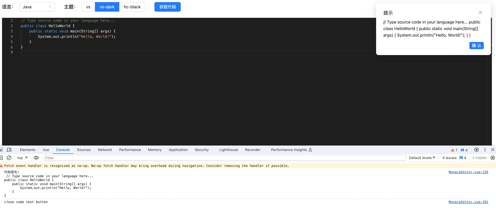

## monaco-edito vue3 代码编辑框

### 一、基本功能介绍

1. 支持自定义语法高亮(`custom-lang-monarch`)
2. 支持标准内置语法高亮 (`JavaScript`、`Java`、`Go`、`Python`、`C++`、`Sql`) 等
3. 多种主题切换 (`vs`、`vs-dark`、`hc-black`)
4. 支持 Ant Design Vue 组件

### 二、安装运行

1、安装

```sh
pnpm install
```

2、本地运行

```sh
pnpm dev
```

3、组件引入

```typescript
<template>
  <div id="app">
    <MonacoEditor
      :style="editorStyle"
      :enableLanguagePicker="true"
      :enableThemePicker="true"
      :sourceCode="sourceCode"
      language="java"
    />
  </div>
</template>

<script setup lang="ts" name="App">
import { ref } from 'vue'
import MonacoEditor from '@/components/MonacoEditor.vue'
const editorStyle = ref({
  height: '300px',
  width: '500px',
  boreder: '1px solid #ccc',
  borderRadius: '4px'
})

let sourceCode = ref(`// Type source code in your language here...
public class HelloWorld {
    public static void main(String[] args) {
        System.out.println("Hello, World!");
    }
}`)
</script>
```

4、组件配置

```typescript
const props = defineProps({
  style: {
    type: Object,
    required: true,
    default: () => ({
      height: '300px',
      width: '100%',
      boreder: '1px solid #ccc',
      borderRadius: '4px'
    })
  },
  enableLanguagePicker: {
    type: Boolean,
    required: false,
    default: () => false
  },
  enableThemePicker: {
    type: Boolean,
    required: false,
    default: () => false
  },
  sourceCode: {
    type: String,
    required: false,
    default: () => `//Type source code in your language here...
    `
  },
  language: {
    type: String,
    required: false,
    default: () => 'java'
  },
  theme: {
    type: String,
    required: false,
    default: () => 'vs-dark'
  },
  readOnly: {
    type: Boolean,
    required: false,
    default: () => false
  }
})
```

### 三、运行效果

#### 1、vs主题


#### 2、vs-dark 主题


#### 3、hc-black 主题


#### 4、获取动态代码


