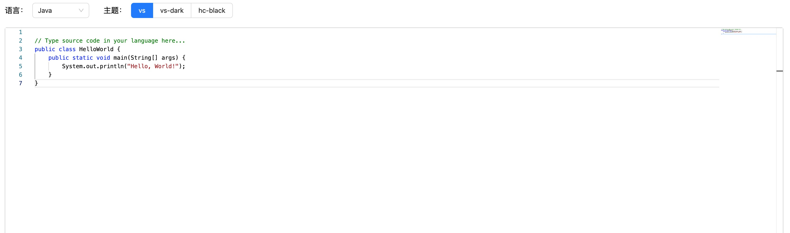
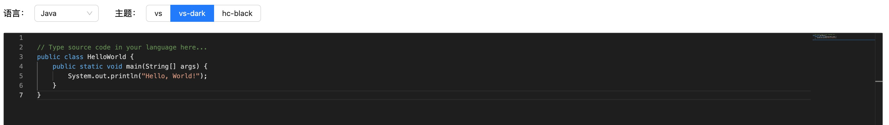
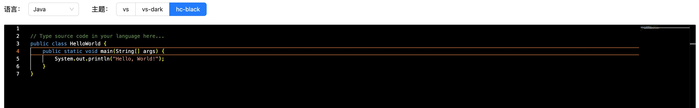

## monaco-edito vue3 代码编辑框

### 一、基本功能介绍

1. 支持自定义语法高亮(`custom-lang-monarch`)、
2. 支持标准内置语法高亮 (`JavaScript`、`Java`、`Go`、`Python`、`C++`、`Sql`) 等
3. 多种主题切换 (`vs`、`vs-dark`、`hc-black`).
4. 引入 Ant Design Vue 交互组件

### 二、安装运行

1、安装

```sh
pnpm install
```

2、本地运行

```sh
pnpm dev
```

### 三、运行效果

#### 1、vs主题


<br/>
<br/>

#### 2、vs-dark 主题


<br/>
<br/>

#### 3、hc-black 主题


<br/>
<br/>
